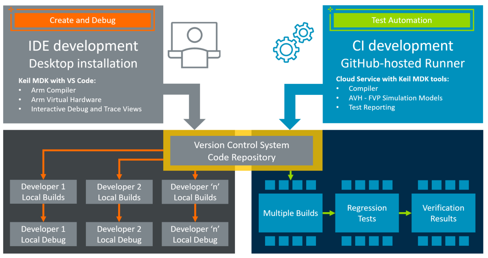

# Arm Virtual Hardware - CI Unit Test

[**Arm Virtual Hardware**](https://www.arm.com/virtual-hardware) simulation models (Fixed Virtual Platforms (FVPs)) implement a Cortex-M, Corstone, or Cortex-M/Ethos-U device sub-systems and are designed for software verification and testing. This allows simulation-based test automation of various software workloads, including unit tests, integration tests, and fault injection. Refer to the [Arm Virtual Hardware documentation](https://arm-software.github.io/AVH/main/overview/html/index.html) for more information.

This **CI Unit Test** uses [GitHub Actions](https://github.com/features/actions) and uses an [GitHub-hosted runner](https://docs.github.com/en/actions/using-github-hosted-runners/about-github-hosted-runners/about-github-hosted-runners) with an Ubuntu Linux system. The tools used in this **CI Unit Test** are part of [Keil MDK Version 6](https://docs.github.com/en/actions/using-github-hosted-runners/about-github-hosted-runners/about-github-hosted-runners). For evaluation purposes the MDK - Community Edition can be used, but commericial usage requires a license of the MDK - Professional Edition.
The tool installation is managed with [vcpkg](https://www.keil.arm.com/artifacts/) using a [configuration file](./tree/main/vcpkg-configuration.json) that ensures consistent setup on Desktop computers and the CI system.

> **Note:**
>
> This is a template repository that can be used as starting point for your own validation projects. Read the [AVH - FVP documentation](https://arm-software.github.io/AVH/main/examples/html/GetStarted.html) to learn how to use it and understand which steps are required to make it work for you.

## Repository Structure

Directory                     | Content
:-----------------------------|----------
[.github/workflow](./tree/main/.github/workflows)  | Workflow YML files that gets you started with GitHub Actions for CMSIS projects.
[Project](./tree/main/Project)                     | A simple unit test application in [*csolution project format*](https://github.com/Open-CMSIS-Pack/cmsis-toolbox).

## Usage

The [Project](./tree/main/Project) tests a single function (*my_sum*) using the [Unity test framework](https://github.com/MDK-Packs/Unity) that is available as [CMSIS software pack](https://www.keil.arm.com/packs/unity-arm-packs). The initial configuration contains a test case error that exemplifies the Unity test reporting.

### GitHub

With GitHub Actions two workflows are available:

- [basic.yml](actions/workflows/basic.yml) compiles and runs the application.
- [basic_w_report.yml](actions/workflows/basic_w_report.yml) compiles and runs the application; then generates a test report using [phoenix-actions/test-reporting](https://github.com/phoenix-actions/test-reporting).

Use in the GitHub web interface the [Actions](./actions) view to execute the *CI test run* and get *Test results*.

### Desktop

**Prerequisite:**

- Install VS Code with [Arm Keil Studio Pack extensions](https://marketplace.visualstudio.com/items?itemName=Arm.keil-studio-pack).
- [Fork](./fork) this repository to your GitHub account.

**Build:**

In VS Code use:

1. Open *Source Control Activity Bar* and use *Clone Repository* to get  the application on your local computer.
2. Open *CMSIS Activity Bar* and *Build* the application.

> **Note:**
>
> When you open the project for the first time, the *Arm Tools Environment* managed with [vcpkg](https://www.keil.arm.com/artifacts/) gets installed which may take some minutes.

**Debug:**

...

**Run:**

...

## Other Developer Resources

Resource           | Description
:------------------|:------------------
[Documentation](https://arm-software.github.io/AVH/main/overview/html/index.html) | Is a comprehensive documentation about Arm Virtual Hardware.
[Support Forum](https://community.arm.com/support-forums/f/arm-virtual-hardware-targets-forum) | Arm Virtual Hardware is supported via a forum. Your feedback will influence future roadmap.
[TFL Micro Speech](https://github.com/arm-software/AVH-TFLmicrospeech) | This example project shows the Virtual Streaming Interface with Audio input.
[Marketing Overview](https://www.arm.com/virtual-hardware) | Gives you a top-level marketing message.
[AVH-MLOps](https://github.com/ARM-software/AVH-MLOps) | Shows the setup of a Docker container with foundation tools.
